<div align="center">
  
</div>

<h1 align="center">
  PocketChat
</h1>

<p align="center">
  <!-- Vue.js -->
  <a href="https://vuejs.org/" target="_blank"></a>
  <!-- TailwindCSS -->
  <a href="https://tailwindcss.com/" target="_blank"></a>
  <!-- TanStack Query -->
  <a href="https://tanstack.com/query/latest" target="_blank"></a>
  <!-- PocketBase -->
  <a href="https://pocketbase.io/" target="_blank"></a>
  </br>
  <!-- License -->
  <a href="https://opensource.org/licenses/MIT" target="_blank"></a>
  <!-- GitHub Release -->
  <a href="https://github.com/PocketTogether/pocket-chat/releases" target="_blank"></a>
  <!-- GitHub Activity -->
  <a href="https://github.com/PocketTogether/pocket-chat/commits" target="_blank"></a>
  </br>
  <!-- Discord -->
  <a href="https://discord.gg/aZq6u3Asak"></a>
  <!-- Telegram -->
  <a href="https://t.me/PocketTogether"></a>
</p>

<p align="center">
  <a href="./README_EN.md">English</a> | 简体中文
</p>

- PocketChat 是一个基于 [PocketBase](https://github.com/pocketbase/pocketbase) 与 [Vue3](https://github.com/vuejs/vue) 的开源实时聊天平台。
- 跨平台支持 linux、windows、macos 。部署便捷，可在 windows 上解压后运行。支持 docker 部署。
- 支持配置 Github、X/Twitter 等 OAuth2 登录/注册方式。
- 支持消息回复、编辑、删除等操作，支持通过消息链接定位访问消息。
- 支持网站内新消息通知，支持桌面新消息通知。
- 支持图片发送、图片查看、图片信息编辑。
- 支持文件发送、文件下载、文件信息编辑。
- 支持用户权限控制：发送消息权限、上传图片权限、上传文件权限、用户封禁功能。
- 支持消息搜索，并可在消息中通过 “#标签” 来快速跳转至搜索页。
- 支持用户艾特功能，可在消息中使用 “@username”，点击后可查看用户详情。
- 支持用户实时状态，如 “在线”、“离线”、“闲置”、“输入中”。
- 支持PWA安装，即“安装”或“添加到主屏幕”。支持一定程度的离线访问。
- 配套安卓项目 [PocketNotifier](https://github.com/PocketTogether/pocket-notifier)，可在手机后台实时获取新消息。
- 项目地址 https://github.com/PocketTogether/pocket-chat
- 预览 https://sakiko.top


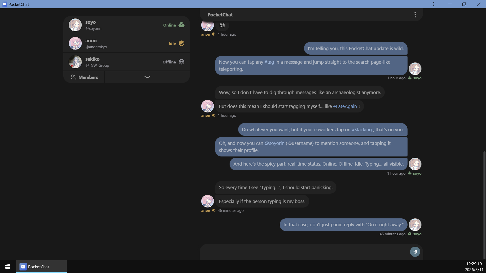

<details>
<summary>📸 <b>更多截图</b></summary>

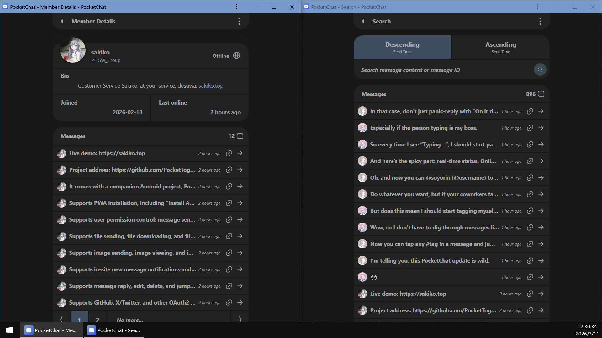
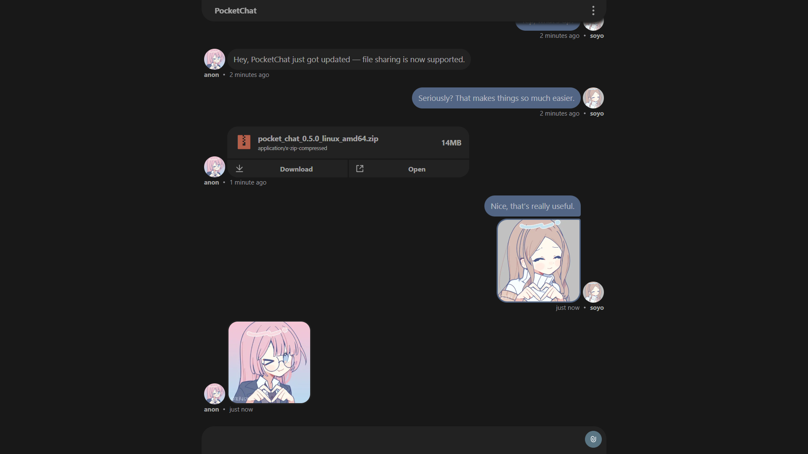
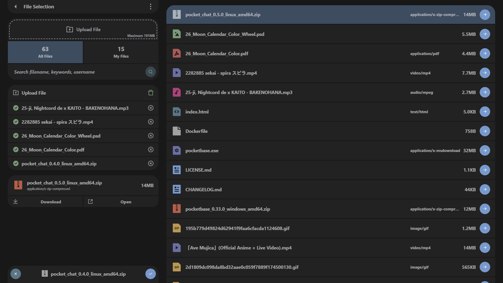


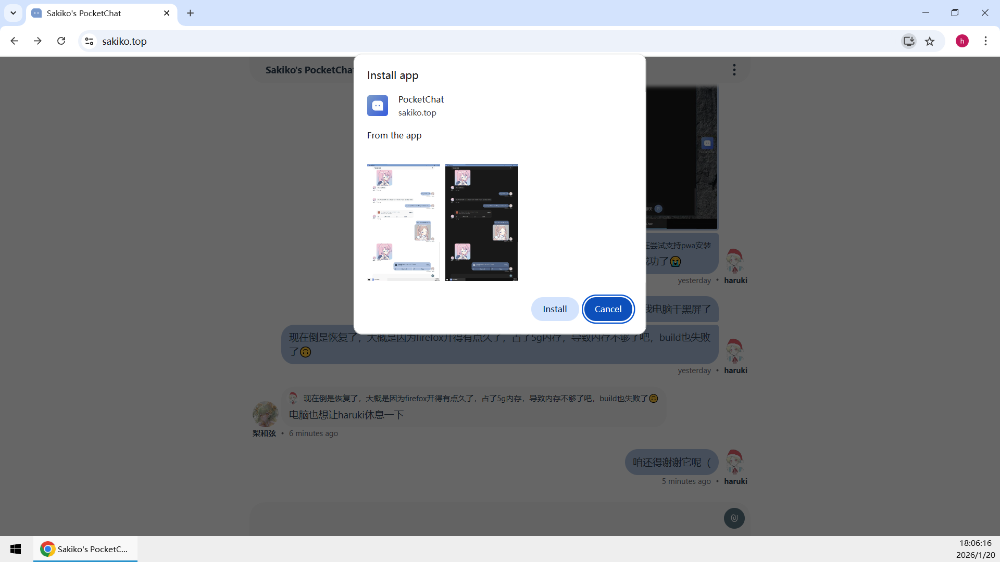
<!--  -->
<!-- 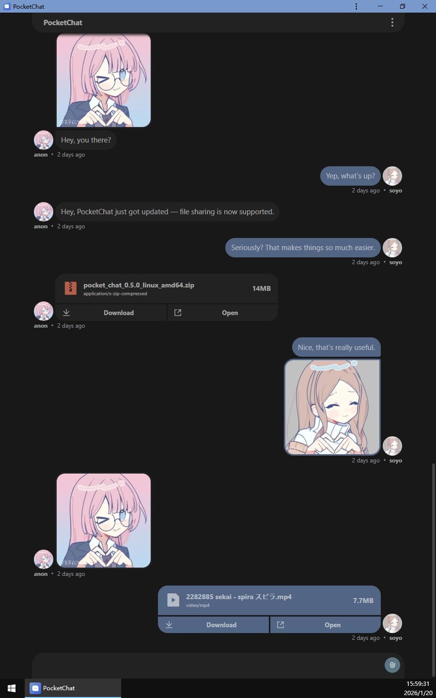 -->
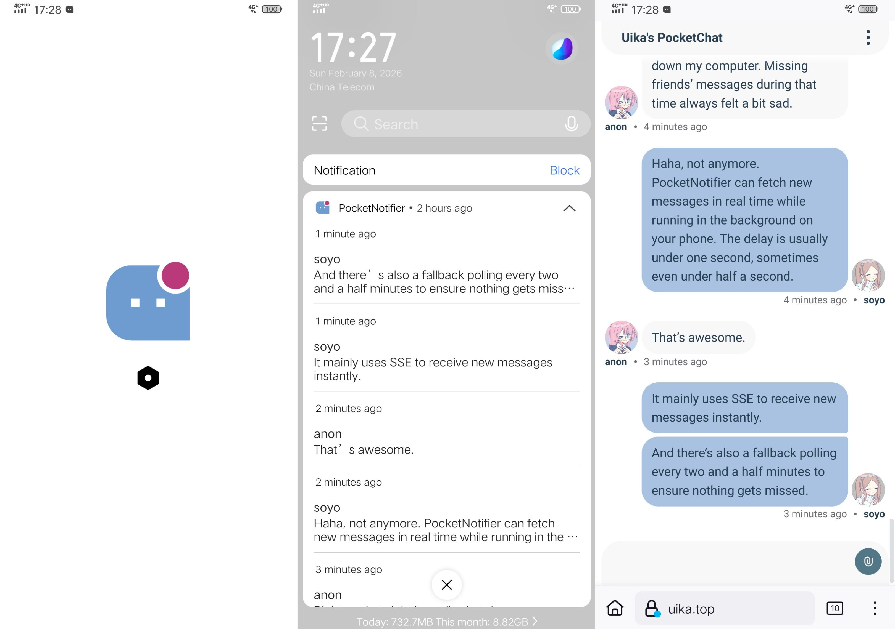
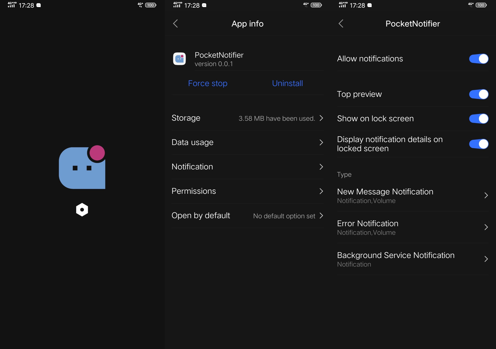

</details>

<details>
<summary>💡 <b>开发计划</b></summary>

- 音视频同步播放
- 语音发送功能

</details>

## 部署

在 linux 上部署前，建议先在 windows 上尝试以便了解 PocketChat。

v0.1.0 版本后已支持 [使用 docker 部署](#使用-docker-部署)。

### 在 windows 上快速尝试

PocketChat 所有的版本更新都在 Github 以 release 形式发布，在 https://github.com/PocketTogether/pocket-chat/releases 下载如 `pocket_chat_0.0.1_windows_amd64.zip` 这样的压缩包。


解压，双击 start.bat 运行，会打开这样的命令行。


与此同时，将会自动在浏览器打开 PocketBase 创建超级用户页面 也就是命令行中的链接如 `http://127.0.0.1:58090/_/#/pbinstal/eyJhbGciOiJI......`。

创建超级用户是 [**部署后的务必进行的操作**](#部署后的务必进行的操作)，详见 [根据日志中的链接创建用于后台管理的超级用户](#根据日志中的链接创建用于后台管理的超级用户)


`http://127.0.0.1:58090/_/` 为 PocketChat 的后台管理页面，创建超级用户后即可访问

- users 集合，可查看所有用户，可修改用户权限，详见 [users 集合 用户权限控制](#users-集合-用户权限控制) （ `v0.3.0` 版本后支持）
- config 集合，可查看或修改关于本项目的一些配置，详见 [config 集合配置](#config-集合配置)
- messages 集合，可查看所有用户发送的所有消息
- images 集合，可查看全部图片（ `v0.2.0` 版本后支持）
- files 集合，可查看全部文件（ `v0.4.0` 版本后支持）


<details>
<summary><b>images 集合 v0.2.0</b></summary>


</details>

<details>
<summary><b>files 集合 v0.4.0</b></summary>

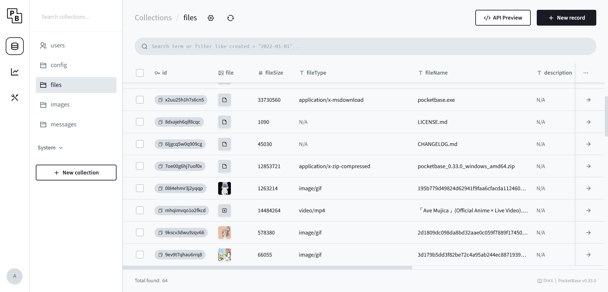

</details>

`http://127.0.0.1:58090` 为 PocketChat 的主页，在浏览器访问即可开始使用。


关于 PocketChat 的更多配置请继续阅读此文档

### 在 linux 上完整部署

为了简单易懂地演示，这里使用 [1Panel](https://github.com/1Panel-dev/1Panel) linux面板来进行 PocketChat 的部署操作

#### 准备网站

准备域名：在自己的域名服务商解析域名，此次部署演示用的域名为 `uika.top`

准备反向代理：在 1Panel(OpenResty) 创建反向代理。反向代理地址即为 http://127.0.0.1:58090 。


> 笔者因为在此之前就已经部署了一个 PocketChat ，默认端口 58090 已被使用了，所以设置的是 58091，之后会讲到 PocketChat 如何 [修改端口](#修改端口)

创建反向代理之后，还要再为它配置 https ，这里就不讲了 [1Panel 文档 HTTPS](https://docs.1panel.pro/user_manual/websites/website_config_basic/#https)

反向代理中配置浏览器缓存，详见 [反向代理中配置浏览器缓存](#反向代理中配置浏览器缓存)

#### 下载与解压

在 1Panel 打开文件管理，在合适的地方创建文件夹，此次演示创建的文件夹为 `/root/pocketchat`

创建并进入文件夹后，点击 远程下载，输入 PocketChat 在 Github Releases 的压缩包的链接，下载如 `pocket_chat_0.0.1_linux_amd64.zip` 这样的压缩包


下载后，点击解压缩进行解压，解压后即可看到如下图所示的这些文件


#### 设置执行权限

点击 `pocketbase` 文件对应的权限数字来设置执行权限


#### 修改端口（可选）

点击打开 `start.sh` （此次演示即为 `/root/pocketchat/start.sh`），就能看到以下内容（在最后一行）。将其中的 `58090` 修改为自己想要的端口即可。

```sh
./pocketbase serve --http 127.0.0.1:58090
```

#### 后台运行与开机自启

在 1Panel 文件管理打开 `/etc/systemd/system` 文件夹，创建文件 `pocketchat.service`，点击此文件以进行编辑，粘贴以下内容（需根据自己的情况进行编辑）

```ini
[Unit]
Description=PocketChat Service
After=network.target

[Service]
Type=simple
WorkingDirectory=/root/pocketchat
ExecStart=/bin/sh /root/pocketchat/start.sh
Restart=always
User=root

[Install]
WantedBy=multi-user.target
```

- WorkingDirectory 为 [下载与解压](#下载与解压) 步骤中创建的文件夹，此次演示中即为 `/root/pocketchat`
- ExecStart 也要根据上述情况进行设置，此次演示中即为 `/bin/sh /root/pocketchat/start.sh`


`pocketchat.service` 文件创建完毕后，在 1Panel 打开终端，依次执行以下命令

```sh
# 重新加载 systemd 配置
systemctl daemon-reload

# 启动服务 pocketchat
systemctl start pocketchat

# 设置开机自启
systemctl enable pocketchat

# 查看日志
journalctl -u pocketchat.service --no-pager -o cat
```


将日志中的链接中的 `127.0.0.1:58090` 替换为自己刚刚配置的域名，`http` 换为 `https`。如下（笔者本次演示中更改了端口，所以是 58091）

```
http://127.0.0.1:58091/_/#/pbinstal/eyJhbGcixxxxxxxxxxx......xxxxxxxxxxxxxx

https://uika.top/_/#/pbinstal/eyJhbGcixxxxxxxxxxx......xxxxxxxxxxxxxx
```

在浏览器访问修改后的链接，即可进入 PocketBase 创建超级用户页面。[创建超级用户](#根据日志中的链接创建用于后台管理的超级用户) 并进行 [**部署后的务必进行的操作**](#部署后的务必进行的操作) 之后，即可开始使用 PocketChat


更多命令参考

```sh
# 查看状态
systemctl status pocketchat
# 重启
systemctl restart pocketchat
# 停止
systemctl stop pocketchat
# 取消开机自启
systemctl disable pocketchat
```

### 使用 docker 部署

可在此查看最新镜像： https://github.com/PocketTogether/pocket-chat/pkgs/container/pocket-chat

```sh
mkdir -p ${HOME}/PocketChat/pb_data
cd ${HOME}/PocketChat

docker run -d \
  --name PocketChat \
  -v ${HOME}/PocketChat/pb_data:/app/pb_data \
  -p 58090:58090 \
  --restart unless-stopped \
  ghcr.io/pockettogether/pocket-chat:latest

docker logs PocketChat
```

### 已部署的 PocketChat 的更新指南

#### 手动部署的更新指南

以下步骤适用于 **通过二进制方式（非 Docker）部署的 PocketChat**。所有操作可以在 1Panel 完成。

##### 1. 停止当前运行的服务
```sh
systemctl stop pocketchat
```

##### 2. 进入 PocketChat 安装目录
PocketChat 的安装目录通常是你当初解压的位置，例如：
```sh
cd /root/pocketchat
```

##### 3. 备份现有版本（可选但推荐）
为了避免更新失败导致数据丢失，你可以将当前目录打包为 .zip 以备份

##### 4. 删除旧版本文件（保留 pb_data）
删除除 `pb_data` 以外的所有文件和文件夹：

> `pb_data` 是 PocketBase 的数据库目录，**必须保留**。

##### 5. 下载并解压新版 PocketChat
从 GitHub Releases 下载最新版本 PocketChat，并解压，例如：
`pocket_chat_0.2.1_linux_amd64.zip`
```
pocket_chat_<VERSION>_linux_amd64.zip
```

##### 6. 需要注意的事项
- **如果你修改过端口**  
  请重新编辑 `start.sh` 中的端口：
  ```sh
  ./pocketbase serve --http 127.0.0.1:58090
  ```
- **如果你修改过前端文件**（例如 `pb_public/index.html`）  
  请重新应用你的自定义修改。
- **确保 pocketbase 可执行文件有执行权限**

##### 7. 启动服务并查看运行状态
启动服务
```sh
systemctl start pocketchat
```
查看运行状态
```sh
systemctl status pocketchat
```
如果状态正常，更新完成。

#### Docker 部署的更新指南
如果你使用 Docker 部署 PocketChat，更新流程会更简单。

##### 1. 查看可用镜像最新版本
访问： https://github.com/PocketTogether/pocket-chat/pkgs/container/pocket-chat

选择你要更新到的版本，例如：
`ghcr.io/pockettogether/pocket-chat:0.2.1`
```
ghcr.io/pockettogether/pocket-chat:<VERSION>
```

提前拉取指定版本镜像（可选）
```sh
docker pull ghcr.io/pockettogether/pocket-chat:<VERSION>
```
- 提前拉取可以更明确地看到下载进度
- 提前拉取可以避免 run 时拉取失败导致容器没创建成功
- CI/CD 场景中 pull 和 run 分开更清晰

##### 2. 停止并删除旧容器（不会删除数据）
```sh
docker stop PocketChat
docker rm PocketChat
```

> 数据保存在挂载的 `${HOME}/PocketChat/pb_data` 中，不会丢失。

##### 3. 使用最新镜像重新启动容器
```sh
docker run -d \
  --name PocketChat \
  -v ${HOME}/PocketChat/pb_data:/app/pb_data \
  -p 58090:58090 \
  --restart unless-stopped \
  ghcr.io/pockettogether/pocket-chat:<VERSION>
```

##### 4. 查看日志确认运行正常
```sh
docker logs PocketChat
```
更新完成。


## 部署后的务必进行的操作

### 根据日志中的链接创建用于后台管理的超级用户

填写 邮箱 与 密码，即可创建超级用户

> 如果不想的话，邮箱不必填真实的邮箱，比如 admin@admin.test  
> （[.test 是一个保留的 顶级域名 它保证永远不会被注册到互联网上 - Wikipedia](https://en.wikipedia.org/wiki/.test)）


### config 集合配置

<!--  -->
<!--  -->
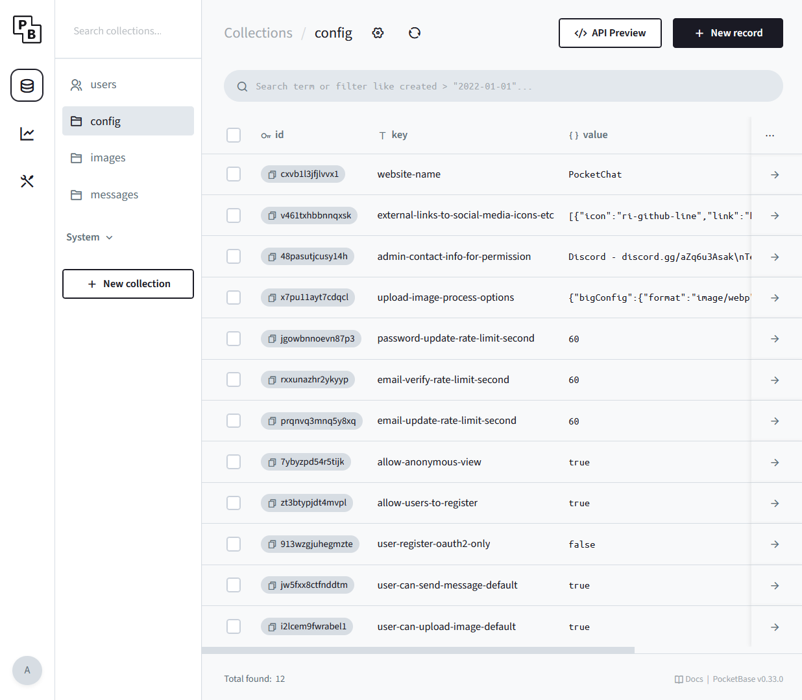

- `website-name` : 网站名称，显示在 登录页 和 聊天主页左上角

- [`external-links-to-social-media-icons-etc`](#社交媒体等图标外链-external-links-to-social-media-icons-etc) : 社交媒体等图标外链（显示在登录页底部的图标链接） 

- [`admin-contact-info-for-permission`](#管理员联系方式-admin-contact-info-for-permission) : 管理员联系方式，主要用于用户权限不足时，提示给用户的联系方式 （ `v0.3.0` 版本后支持）

- [`upload-image-process-options`](#图片处理配置-upload-image-process-options) : 图片处理配置 `v0.2.0`

- `password-update-rate-limit-second` : 发送密码修改请求后，需要等待一段时间，才能再次进行这一操作。此值控制需等待的时间，单位为秒。

- `email-verify-rate-limit-second` : 发送邮箱验证请求后，需要等待一段时间，才能再次进行这一操作。此值控制需等待的时间，单位为秒。

- `email-update-rate-limit-second` : 发送邮箱修改请求后，需要等待一段时间，才能再次进行这一操作。此值控制需等待的时间，单位为秒。

- `allow-anonymous-view` : 是否允许游客浏览，为 `true` 则允许游客浏览，为 `false` 则只允许已登录的用户浏览

- `allow-users-to-register` : 是否开启用户注册，为 `true` 则允许用户注册，为 `false` 则不允许 且登录页将不显示注册表单

- `user-register-oauth2-only` : 是否只允许oauth2注册，默认值为 `false` （ `v0.3.0` 版本后支持）
  - 为 `true` 则只允许通过 oauth2 注册，将禁止邮箱密码注册，且登录页将不显示注册表单
  - 为 `false` 则 oauth2 注册、邮箱密码注册 都会被允许
  - 注意： `allow-users-to-register` 为 `false` 时，注册功能整体关闭，此时 user-register-oauth2-only 不生效。

- `user-can-send-message-default` : 是否默认允许发送消息，默认值为 `true` （ `v0.3.0` 版本后支持）
  - 用于控制当 users 集合中用户记录中的 canSendMessage 字段未设置时，系统对该用户的默认消息发送权限。该配置仅在用户记录未设置 canSendMessage 时生效，若用户记录中显式设置为 "YES" 或 "NO"，则以用户记录为准。详见 [users 集合 用户权限控制](#users-集合-用户权限控制)
  - `true` ，当用户的 canSendMessage 字段未设置时，系统默认允许该用户发送消息
  - `false` ，当用户的 canSendMessage 字段未设置时，系统默认不允许该用户发送消息

- `user-can-upload-image-default` : 是否默认允许上传图片，默认值为 `true` （ `v0.3.0` 版本后支持）
  - 和 `user-can-send-message-default` 类似
  - `true` ，当用户的 canUploadImage 字段未设置时，系统默认允许该用户上传图片
  - `false` ，当用户的 canUploadImage 字段未设置时，系统默认不允许该用户上传图片

- `user-can-upload-file-default` : 是否默认允许上传文件，默认值为 `true` （ `v0.4.0` 版本后支持）  
  - 和 `user-can-upload-image-default` 类似
  - `true` ，当用户的 canUploadFile 字段未设置时，系统默认允许该用户上传文件  
  - `false` ，当用户的 canUploadFile 字段未设置时，系统默认不允许该用户上传文件  

- `user-max-upload-file-size-default` : 默认文件上传大小限制（字节数），默认值为 `20971520` （`20 * 1024 * 1024`） 即 20MB （ `v0.4.0` 版本后支持）  
  - 用于控制当 users 集合中用户记录中的 maxUploadFileSize 字段为 `0` 时，系统对该用户的默认最大文件上传大小限制。
  - 必须为正整数（大于 0 的整数），单位为字节  
  - 注意 maxUploadFileSize 或 user-max-upload-file-size-default 都仅仅是给前端提供数据，是由前端来进行大小限制的，详见 [users 集合 用户权限控制 maxUploadFileSize](#maxuploadfilesize)

#### 社交媒体等图标外链 external-links-to-social-media-icons-etc


默认值为

```json
[
  {
    "icon": "ri-github-line",
    "link": "https://github.com/PocketTogether/pocket-chat",
    "name": "github"
  },
  {
    "icon": "ri-discord-line",
    "link": "https://discord.gg/aZq6u3Asak",
    "name": "discord"
  },
  {
    "icon": "ri-telegram-2-line",
    "link": "https://t.me/PocketTogether",
    "name": "telegram"
  }
]
```

如果不需要图标外链则可以设置为空数组 `[]`

`icon` 使用的图标为 https://remixicon.com/ ，使用其图标的 `class` 值


### 管理员联系方式 admin-contact-info-for-permission

默认值为 空字符串 `""`

建议设置为像这样的文本（`\n` 表示换行）
```
"Discord - discord.gg/aZq6u3Asak\nTelegram - t.me/PocketTogether"
```

在前端中显示的效果为

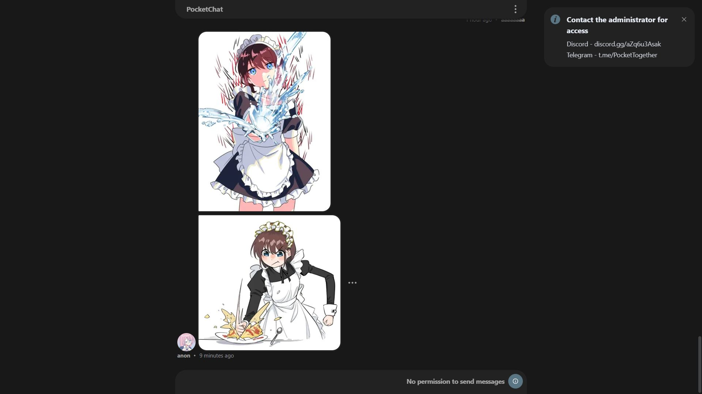

#### 图片处理配置 upload-image-process-options


默认值为

```json
{
  "bigConfig": {
    "format": "image/webp",
    "quality": 0.9,
    "sumWidthHeightLimit": 4000
  },
  "imageConfig": {
    "format": "image/webp",
    "quality": 0.8,
    "sumWidthHeightLimit": 2000
  },
  "smallConfig": {
    "format": "image/webp",
    "quality": 0.8,
    "sumWidthHeightLimit": 1200
  },
  "tinyConfig": {
    "format": "image/webp",
    "quality": 0.8,
    "sumWidthHeightLimit": 800
  }
}
```

配置说明

```
bigConfig 大图的配置
imageConfig 中图的配置
smallConfig 小图的配置
tinyConfig 超小图的配置

format 为图片应处理为的格式，支持："image/png" | "image/jpeg" | "image/webp"

quality 为图片质量，为 0 到 1 之间的数字，只在 "image/jpeg" | "image/webp" 时生效

sumWidthHeightLimit 为图片长宽之和的限制值，将按此值将图片处理为不同大小的图片
注意，其值要符合 bigConfig > imageConfig > smallConfig > tinyConfig

（前端会根据元素尺寸与屏幕分辨率，选择尺寸最合适的图片来显示）
```

#### config 重置为默认

将 config 集合中任意一项删除，然后重启 PocketChat，此项配置就会重置为默认值。

#### config 配置正确性检验

config 集合修改后，重新打开前端网页（注意是根路径的面向用户的网页，而不是pocketbase的管理面板网页），并打开浏览器的开发者工具，查看其控制台，如果没有错误信息即代表配置正确

如果某个配置缺失，如 `external-links-to-social-media-icons-etc` 缺失，将显示如下错误信息
```
src\queries\pb-collection-config.ts
usePbCollectionConfigQuery
findKeyItem == null
key: external-links-to-social-media-icons-etc
```

如果某个配置错误，如 `upload-image-process-options` 配置的类型错误，将显示如下错误信息
```
src\queries\pb-collection-config.ts
usePbCollectionConfigQuery
findKeyItemParseResult.success === false
key: upload-image-process-options
```


### users 集合 用户权限控制

<!-- 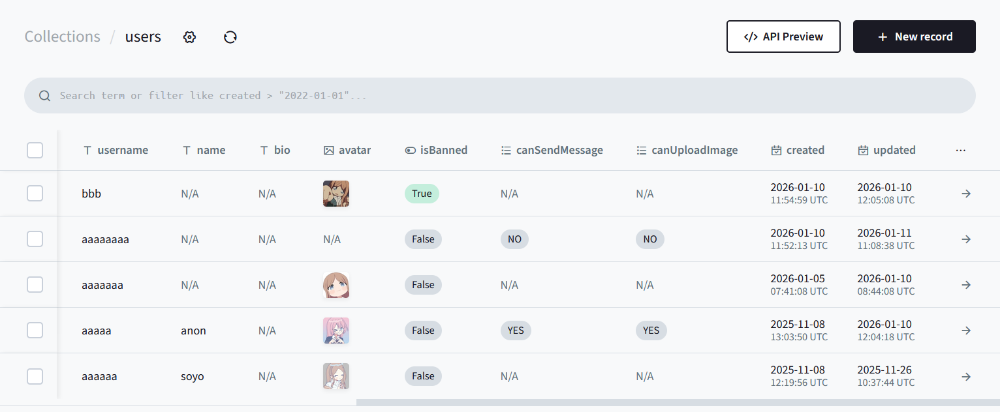 -->
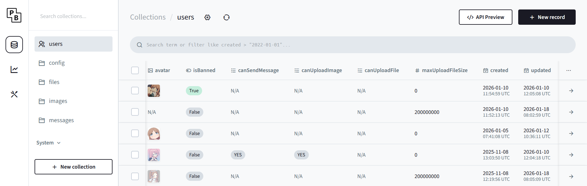

#### canSendMessage
用于控制用户是否具备发送消息的权限。  
- 字段类型：**select**，可选值：
- `"YES"`：显式允许该用户发送消息  
- `"NO"`：显式禁止该用户发送消息  
- `N/A`（默认）：未设置，此时系统将根据 config 集合中的  
  **user-can-send-message-default** 配置决定是否允许发送消息

#### canUploadImage
用于控制用户是否具备上传图片的权限。  
- 字段类型：**select**，可选值：
- `"YES"`：显式允许该用户上传图片  
- `"NO"`：显式禁止该用户上传图片  
- `N/A`（默认）：未设置，此时系统将根据 config 集合中的  
  **user-can-upload-image-default** 配置决定是否允许上传图片

#### canUploadFile
用于控制用户是否具备上传文件的权限。  
- 字段类型：**select**，可选值：  
- `"YES"`：显式允许该用户上传文件  
- `"NO"`：显式禁止该用户上传文件  
- `N/A`（默认）：未设置，此时系统将根据 config 集合中的  
  **user-can-upload-file-default** 配置决定是否允许上传文件  

#### maxUploadFileSize
用于控制用户可上传文件的最大大小（字节数）。  
- 字段类型：**number**，需为大于或等于 `0` 的整数  
- `> 0`：显式指定该用户可上传文件的最大大小（字节数）  
- `0`（默认）：未设置，此时系统将根据 config 集合中的  
  **user-max-upload-file-size-default** 配置决定该用户可上传文件的最大大小  

额外说明：  
- `maxUploadFileSize` 与 `user-max-upload-file-size-default` **仅用于前端限制**，因为 PocketBase 当前不支持在 API 规则中限制文件大小  
- 但 `canUploadFile` 这类的可以放心，其可在前后端双重保证

如果想强制限制上传文件大小（会对所有用户生效），可在 files集合-设置-file字段 修改其 `Max file size` ，修改后记得保存

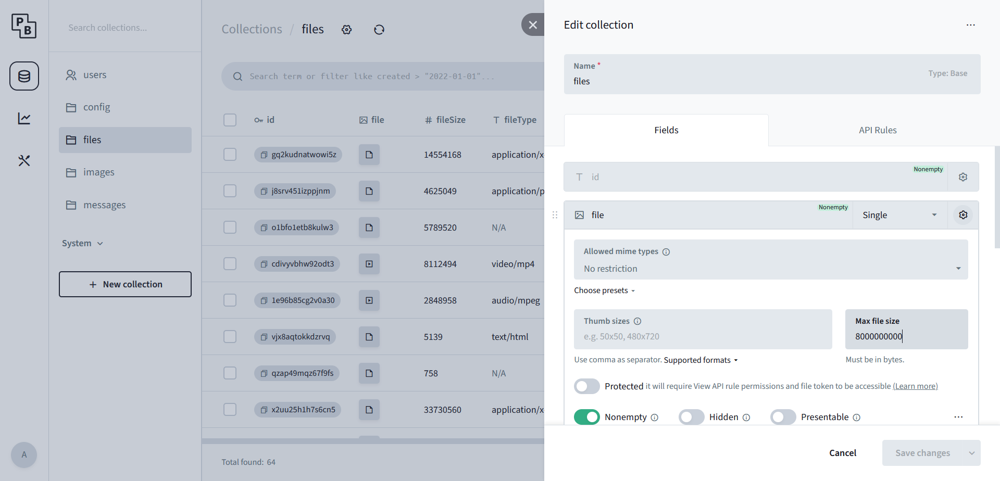

#### isBanned
用于标记用户是否被封禁。  
- 字段类型：**boolean**
- **false**（默认）：用户正常，可登录、可使用功能  
- **true**：用户已被封禁，该用户将无法访问全部内容

封禁效果
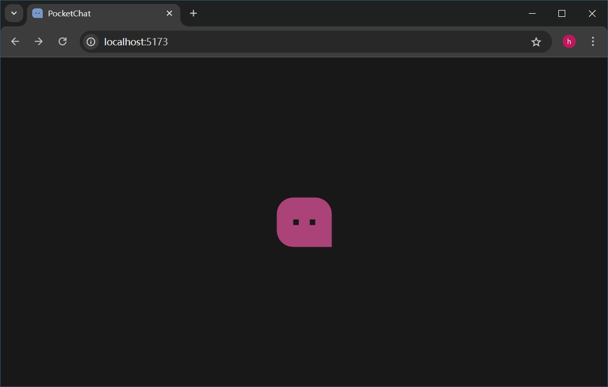

### Application 信息配置


- **Application name** ，邮件发送将使用此值，建议和 config 集合中的 `website-name` 保持一致
- **Application URL** ，邮件发送将使用此值，应设置为自己的网站链接

关于 **User IP proxy headers** ，自己用了 cloudflare ，需按照其提示添加 `CF-Connecting-IP`，即可解除其警告，并能解析到用户的真实ip


建议浏览 [PocketBase](https://pocketbase.io) 官网进一步了解 PocketBase，并查看 [生产环境的建议](https://pocketbase.io/docs/going-to-production/)

### pb_public index.html 网站元信息配置

用于在社交媒体等地方预览网站的网站元信息，配置在 `pb_public/index.html` ，可以根据自己的信息来修改


`index.html` 也控制着网站的加载动画，有能力的话也可以自己修改

## 配置发送电子邮件的设置

用户修改邮箱、验证邮箱、重置密码、等功能需要向用户的邮箱发送邮件，不配置的话就无法使用这些功能。

应使用 SMTP ，`sakiko.top` 的邮件服务是这样配置的：


笔者使用的是自建邮箱： https://docker-mailserver.github.io/docker-mailserver/latest/usage/

或使用 PocketBase 官网中提到的  MailerSend, Brevo, SendGrid, Mailgun, AWS SES ：https://pocketbase.io/docs/going-to-production/#use-smtp-mail-server

## 配置 OAuth2 登录/注册

PocketBase OAuth2 : https://pocketbase.io/docs/authentication/#authenticate-with-oauth2

（现在看到 users 集合有警告提示图标是因为没有配置 OAuth2 ，是正常现象，即使不打算配置 OAuth2 也不必担心）


在 PocketBase 中的 user 集合，点击设置图标，点击 **Options** ，展开 **OAuth2** ，点击 **Add provider** ，选择对应的平台即可进行配置

.png)

以 github 为例 ，访问 https://github.com/settings/developers 以创建 OAuth App


点击 New OAuth App ，填写表单进行创建，此处用 `uika.top` 来演示


**Authorization callback URL** 很重要，应填写自己的域名 + /api/oauth2-redirect ，详见 [PocketBase OAuth2](https://pocketbase.io/docs/authentication/#authenticate-with-oauth2)

```
https://yourdomain.com/api/oauth2-redirect
```

创建后即可看到这样的页面，`Client ID` 与 `Client secrets` 就是我们需要的


除此之外，还能设置 Application logo ，可使用此图标 https://github.com/PocketTogether/pocket-chat/blob/master/resources/icon1.png

## 反向代理中配置浏览器缓存

- 建议不要使用 1Panel 的可视化表单来配置反向代理。
- 更推荐在 1Panel 中直接编辑 Nginx 配置文件，以手动方式完成反向代理与浏览器缓存策略的设置。
- 这种方式更灵活，也更适合 PocketChat 所需的精细化缓存控制（例如静态资源缓存、PocketBase 文件缓存、动态内容 no-cache 等）。
- v0.5.0 后，为了更稳定地支持pwa安装，还要在此为 manifest.webmanifest 设置正确的 MIME

```nginx
# PocketBase file caching
location ^~ /api/files/ {
    proxy_pass http://127.0.0.1:58090;

    proxy_set_header Host $host;
    proxy_set_header X-Real-IP $remote_addr;
    proxy_set_header X-Forwarded-For $proxy_add_x_forwarded_for;
    proxy_set_header REMOTE-HOST $remote_addr;
    proxy_set_header Upgrade $http_upgrade;
    proxy_set_header Connection $http_connection;
    proxy_set_header X-Forwarded-Proto $scheme;
    proxy_http_version 1.1;
    add_header X-Cache $upstream_cache_status;
    proxy_ssl_server_name off;
    proxy_ssl_name $proxy_host;
    
    expires 180d;
    add_header Cache-Control "public, max-age=15552000, s-maxage=15552000, immutable";
}

# Static asset caching
location ~ (^/assets/|^/workbox-|^/remixicon|^/Snipaste_|^/_/) {
    proxy_pass http://127.0.0.1:58090;

    proxy_set_header Host $host;
    proxy_set_header X-Real-IP $remote_addr;
    proxy_set_header X-Forwarded-For $proxy_add_x_forwarded_for;
    proxy_set_header REMOTE-HOST $remote_addr;
    proxy_set_header Upgrade $http_upgrade;
    proxy_set_header Connection $http_connection;
    proxy_set_header X-Forwarded-Proto $scheme;
    proxy_http_version 1.1;
    add_header X-Cache $upstream_cache_status;
    proxy_ssl_server_name off;
    proxy_ssl_name $proxy_host;
    
    expires 180d;
    add_header Cache-Control "public, max-age=15552000, s-maxage=15552000, immutable";
}

# Dynamic content (HTML, API, etc.)
location / {
    proxy_pass http://127.0.0.1:58090;

    proxy_set_header Host $host;
    proxy_set_header X-Real-IP $remote_addr;
    proxy_set_header X-Forwarded-For $proxy_add_x_forwarded_for;
    proxy_set_header REMOTE-HOST $remote_addr;
    proxy_set_header Upgrade $http_upgrade;
    proxy_set_header Connection $http_connection;
    proxy_set_header X-Forwarded-Proto $scheme;
    proxy_http_version 1.1;
    add_header X-Cache $upstream_cache_status;
    proxy_ssl_server_name off;
    proxy_ssl_name $proxy_host;

    add_header Cache-Control "no-cache";
}

# Set the correct MIME type for manifest.webmanifest
location = /manifest.webmanifest {
    proxy_pass http://127.0.0.1:58090;

    proxy_set_header Host $host;
    proxy_set_header X-Real-IP $remote_addr;
    proxy_set_header X-Forwarded-For $proxy_add_x_forwarded_for;
    proxy_set_header REMOTE-HOST $remote_addr;
    proxy_set_header Upgrade $http_upgrade;
    proxy_set_header Connection $http_connection;
    proxy_set_header X-Forwarded-Proto $scheme;
    proxy_http_version 1.1;
    add_header X-Cache $upstream_cache_status;
    proxy_ssl_server_name off;
    proxy_ssl_name $proxy_host;

    proxy_hide_header Content-Type;
    add_header Content-Type "application/manifest+json";
    add_header Cache-Control "no-cache";
}
```

### 关于 PocketBase 文件的一些说明

PocketBase 的所有文件（图片、视频等）都通过固定路径访问：
```
/api/files/:collectionId/:recordId/:filename

http://127.0.0.1:58090/api/files/pbc_3607937828/426c1mnva7cd4k4/image_twlm01yw5w.webp
```

每个上传的文件都将以原始文件名（已脱敏处理）存储，并添加一个后缀。 随机部分（通常为 10 个字符）。例如： 
```
image_twlm01yw5w.webp
```

https://pocketbase.io/docs/files-handling/#file-url

## 开发指南

pocket-chat 项目目录结构

- `pocketbase/` 为 PocketBase 所在的文件夹
- `vue3/` 为 Vue3 前端文件夹
- `project-tools-node/` 为项目打包工具脚本文件夹
- `pocketbase-typegen/` 为pocketbase类型生成工具
- `resources/` 为项目中所用到的一些图片资源
- `note/` 为项目开发过程中的一些笔记（在本项目中很少，更多的在 [PocketTogether](#关于-pockettogether) 中）
- `assets/` README.md 中使用的一些图片

### pocketbase 后端

建议用 vscode 打开 `pocketbase/` 目录进行开发（而不是打开 本项目根目录），比如修改 `pocketbase/pb_hooks/` 目录中的 js 文件时，要借助 `pocketbase/jsconfig.json` 使其更类型严格，`pocketbase/pb_hooks/` 目录中的 js 代码应使用 jsDoc 来设置类型。

为了不增加项目git体积，为 `pocketbase.exe` 配置了忽略，即本项目仓库中并不包含 `pocketbase.exe` ，在进行开发前需要手动下载 `pocketbase.exe` ，在 https://github.com/pocketbase/pocketbase/releases 下载压缩包，解压后将 `pocketbase.exe` 复制到本项目 `pocketbase/` 目录中。

关于本项目所使用的 `pocketbase.exe` 具体版本可以查看 `pocketbase/CHANGELOG.md` ，以其中最新（最靠上）的版本为准。

双击 `pocketbase/start.sh` 即可启动本项目的 PocketBase

如果在本项目的 PocketBase 的 Web UI 中修改了数据库架构，请在 `http://127.0.0.1:58090/_/#/settings/export-collections` 将其内容复制到 `pocketbase/pb_schema.json` ，并在前端重新 [生成后端数据库的 TS 类型](#生成后端数据库的-ts-类型)。

关于 `pocketbase/pb_schema.json` ，pocketbase 的运行并不依赖于这个文件，其目的主要是为了借助git更清晰地观察数据库架构变化。此外它的另一个重要用处是帮助前端 [生成后端数据库的 TS 类型](#生成后端数据库的-ts-类型)

### vue3 前端

建议用 vscode 打开 `vue3/` 目录进行开发（而不是打开 本项目根目录）

```sh
# Project Setup
pnpm install

# Compile and Hot-Reload for Development
pnpm dev

# Type-Check, Compile and Minify for Production
pnpm build

# Lint with ESLint
pnpm lint
```

#### 生成后端数据库的 TS 类型

本项目使用 [pocketbase-typegen](https://www.npmjs.com/package/pocketbase-typegen) 来在前端生成 pocketbase 后端的数据类型：
`"pocketbase-typegen": "^1.3.1",`

【260111】自己对 pocketbase-typegen 改了改，将其本地化在了 `pocketbase-typegen/` 目录，应在此目录安装依赖后，再在前端中使用
```sh
# pwd
# /e/Project/pocket-chat/pocketbase-typegen
pnpm i
```

前端使用
```sh
# pwd
# /e/Project/pocket-chat/vue3

pnpm pb-typegen-json

# package.json - scripts
# "pb-typegen-json": "node scripts/pocketbase-typegen.cjs"
```

关于 `pocketbase-typegen/` 其详情可参考
```
vue3\scripts\pocketbase-typegen.cjs
pocketbase-typegen\README.md
pocketbase-typegen\README-pocketbase-typegen.md
```

### 关于 PocketTogether

[PocketTogether](https://github.com/PocketTogether/pocket-together) 是一个基于 PocketBase 与 Vue3 的实时群聊与同步观看平台（开发中），PocketChat 其实是 PocketTogether 的半成品。
