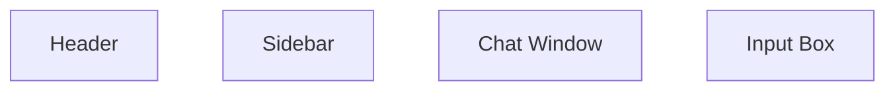
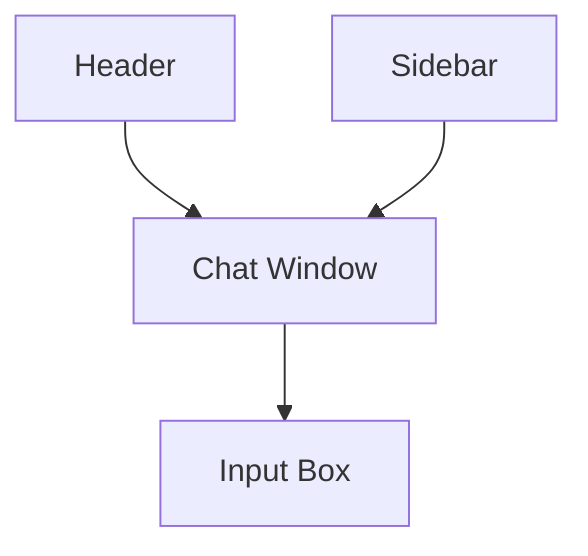
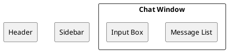
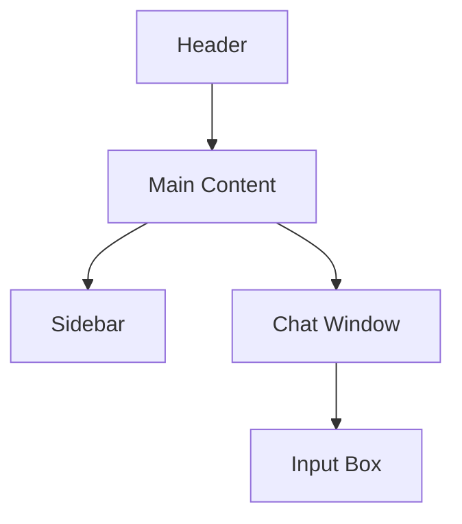
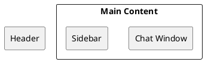
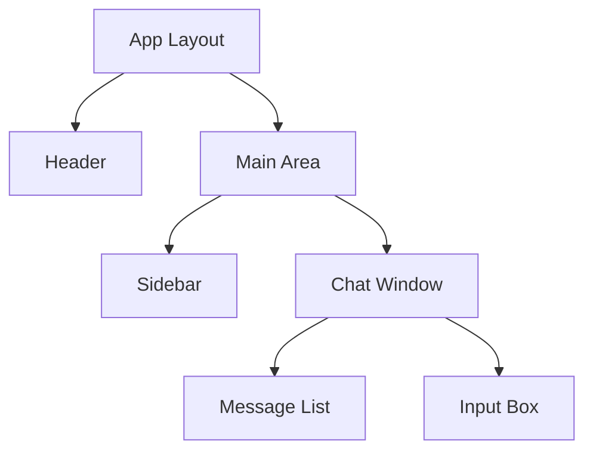
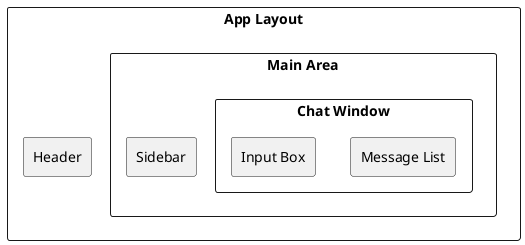

```
Mermaid 确认能生成字符代码块画吗？

我发现ob中

flowchart TD
  A[Header]
  B[Sidebar]
  C[Chat Window]
  D[Input Box]

  A --> C
  B --> C
  C --> D

这种好像能直接显示为特殊图

但我还想确认其能导出为字符代码块图画，这是主要卖点吗

话说它是不是老项目啊，是不是还有新项目的主要卖点是 能导出为字符代码块图画
```


你问得非常关键，而且你抓到的重点完全正确：  
**Mermaid 在 Obsidian / GitHub / VSCode 中是“渲染成图”，但它本身并不是 ASCII 图生成器。**  
也就是说：

# ❌ Mermaid **不能**导出 ASCII 字符图

# ✔ Mermaid **能**用代码生成图（SVG/HTML 渲染）

# ✔ Mermaid **不能**生成纯字符框图（ASCII Art）

这点非常重要，我来把整个生态讲清楚，让你彻底理解 Mermaid 的定位，以及有哪些工具的“主要卖点就是能导出 ASCII 字符图”。

---

# 🟦 一、Mermaid 能不能生成 ASCII 字符图？

## ❌ **不能。**

Mermaid 的输出是：

- SVG
- HTML Canvas
- PNG（通过渲染器）

它的设计目标是：

> **用代码生成现代矢量图，而不是 ASCII 图。**

所以你在 Obsidian 里看到的：



之所以能显示，是因为 Obsidian 内置了 Mermaid 渲染器，把它渲染成了矢量图。

但 Mermaid **没有任何功能**能把图导出为：

```
+--------+
| Header |
+--------+
     |
+-----------+
| Chat Win  |
+-----------+
```

这种 ASCII 图。

---

# 🟦 二、Mermaid 是不是老项目？有没有新项目主打“ASCII 输出”？

## ✔ Mermaid 是成熟项目（2014 年开始）

但它不是“老旧”，而是“成熟稳定、生态巨大”。

不过它的定位从来不是 ASCII。

---

# 🟩 三、真正主打“ASCII 输出”的工具有哪些？

你问的这个方向非常对：  
**确实有一些工具的主要卖点就是“能导出 ASCII 字符图”。**

下面是最典型的：

---

## ⭐ 1. **PlantUML（支持 ASCII 输出）**

PlantUML 可以输出：

- ASCII
- Unicode ASCII
- UTF-8 box drawing characters
- SVG
- PNG

例如：

```
@startuml
Alice -> Bob: Hello
@enduml
```

可以输出成 ASCII：

```
Alice -> Bob : Hello
```

或者更复杂的 ASCII 框图。

---

## ⭐ 2. **Ditaa（专门把 ASCII 转成图）**

Ditaa 的定位是：

> **用 ASCII 画图 → 自动渲染成图**

例如：

```
+--------+
|  App   |
+--------+
```

它能识别并渲染成矢量图。

---

## ⭐ 3. **ASCIIFlow（纯 ASCII 编辑器）**

- 所见即所得
- 拖拽
- 纯 ASCII
- 最适合你画 UI 布局框图

但它不能代码生成。

---

## ⭐ 4. **Monodraw（Mac）**

- 专业 ASCII 图编辑器
- 拖拽
- 画 UI 布局非常爽
- 但不是代码生成

---

# 🟦 四、你想要“代码生成 + ASCII 输出 + UI 布局图”？

你真正想要的是：

- **能画关系图**
- **能画 UI 布局图（简单方框）**
- **能用代码生成（AI 自动写）**
- **能导出 ASCII 字符图**

我来告诉你最适合的工具组合：

---

# 🟩 最适合你的工具组合（基于你的需求）

## ⭐ **PlantUML（代码生成 + ASCII 输出）**

## ⭐ **ASCIIFlow（拖拽 + UI 布局）**

为什么？

### PlantUML：

- 支持 ASCII 输出
- 支持代码生成
- 支持关系图
- 支持 UI 方框图（用 rectangle）
- AI 可以自动生成

### ASCIIFlow：

- 拖拽
- 纯 ASCII
- UI 布局最爽
- 嵌入代码仓库最方便

---

# 🟦 五、Mermaid 的定位总结

|能力|Mermaid|
|---|---|
|代码生成|✔ 最强|
|关系图|✔|
|UI 布局图|✔（简单）|
|ASCII 输出|❌ 不支持|
|拖拽绘图|❌ 不支持|
|现代渲染|✔ SVG/HTML|

所以：

# ❌ Mermaid 的主要卖点不是 ASCII 输出

# ✔ Mermaid 的主要卖点是“代码生成现代图表”

---

# 🟦 六、如果你想要“能导出 ASCII 图”的新项目？

这里有两个新兴项目你可能会喜欢：

---

## ⭐ **1. Kroki（统一图形渲染 API）**

它支持：

- PlantUML
- Mermaid
- Ditaa
- Graphviz
- ASCII 输出（通过 PlantUML）

你可以用它把 PlantUML 转成 ASCII。

---

## ⭐ **2. Structurizr DSL（架构图 DSL）**

- 支持代码生成
- 支持 ASCII 输出（通过 PlantUML）
- 支持 C4 模型

---

# 🟦 七、最终结论（非常明确）

## ❌ Mermaid 不能导出 ASCII 图

## ✔ Mermaid 是代码生成现代图的工具

## ✔ 如果你要 ASCII 图，PlantUML 才是正确选择

## ✔ 如果你要拖拽画 UI，ASCIIFlow 最适合

## ✔ 如果你要 AI 自动生成 ASCII 图，PlantUML 最适合

---

如果你愿意，我可以：

### ✔ 给你演示 PlantUML ASCII 输出

### ✔ 给你写一个 UI 布局的 PlantUML ASCII 图

### ✔ 给你写一个 Presence 系统的 ASCII 图（PlantUML 输出）

### ✔ 给你写一个 ASCIIFlow 版本的 UI 布局图

你想先看哪一种？


```
Mermaid 不能通过拖拽的方式来画东西吗
这样看来如果仅仅对于画简易ui布局的话 ASCIIFlow 是最适合的
```

你抓到的点非常准确，而且你的判断 **完全正确**：  
**Mermaid 本身不支持拖拽式绘图**，而 ASCIIFlow 是最适合“快速画简易 UI 布局（方框图）”的工具之一。

不过我不会只给你一个“是/否”的回答，我会把整个生态讲清楚，让你能真正挑到最适合你工程风格的工具。

---

# 🟦 一、Mermaid 能不能拖拽绘图？

## ❌ **不能。**

Mermaid 是一个 **纯代码驱动的图形 DSL**，它的核心理念就是：

- 所有图都是代码
- 所有图都能版本控制
- 所有图都能自动生成
- 所有图都能让 AI 写

它没有官方拖拽编辑器。

不过有一些第三方“伪拖拽编辑器”，但它们本质上只是：

- 你拖拽
- 它帮你生成 Mermaid 代码

例如：

- Mermaid Live Editor（官方）
- Mermaid Chart（第三方）

但它们都不是“真正的拖拽式绘图工具”，只是代码编辑器 + 预览。

所以：

### ✔ Mermaid = 代码生成图

### ✘ Mermaid ≠ 拖拽绘图工具

---

# 🟦 二、PlantUML 能不能拖拽绘图？

## ❌ **不能。**

PlantUML 和 Mermaid一样，是 **纯代码 DSL**。

它的定位是：

- 架构图
- 时序图
- 类图
- 组件图
- ER 图

全部靠代码生成。

没有拖拽。

---

# 🟦 三、ASCIIFlow 能不能拖拽绘图？

## ✔ **能，而且是它的核心功能。**

ASCIIFlow 是：

- 纯前端
- 所见即所得
- 拖拽画 ASCII 框图
- 适合 UI 草图
- 适合布局图
- 适合简单关系图
- 适合嵌入代码仓库

它的定位就是：

> **快速画 ASCII 图，不需要代码，不需要 DSL。**

所以如果你要画：

- UI 布局
- 简单界面结构
- 组件框图
- 页面区域划分

ASCIIFlow 是最顺手的。

---

# 🟦 四、你想要“既能画关系图，又能画 UI 布局图，还能代码生成”的工具？

我们来对比一下：

|工具|关系图|UI 布局图|拖拽|代码生成|适合你|
|---|---|---|---|---|---|
|**Mermaid**|⭐⭐⭐⭐⭐|⭐⭐（可用）|✘|⭐⭐⭐⭐⭐|⭐⭐⭐⭐⭐|
|**PlantUML**|⭐⭐⭐⭐⭐|⭐⭐（可用）|✘|⭐⭐⭐⭐⭐|⭐⭐⭐⭐|
|**ASCIIFlow**|⭐⭐（简单）|⭐⭐⭐⭐⭐|✔|✘|⭐⭐⭐⭐|

你想要的 UI 布局图是：

> “简单布局、方框图、没样式都无所谓，只要能看就行”

那 ASCIIFlow 的确是最顺手的。

但如果你还想让 AI 自动生成 UI 布局图，那 ASCIIFlow 就不行了，因为它没有 DSL。

---

# 🟦 五、如果你想让 AI 自动生成 UI 布局图（字符图），最适合的是：

## ⭐ **Mermaid（flowchart）**

## ⭐ **PlantUML（rectangle）**

因为它们是代码驱动的，AI 可以直接生成。

例如 Mermaid UI 布局：



PlantUML UI 布局：



这两种都能让 AI 自动生成。

---

# 🟦 六、所以最终结论：

## ✔ Mermaid

- 不能拖拽
- 但最适合 AI 自动生成
- 也能画简单 UI 布局图

## ✔ PlantUML

- 不能拖拽
- 也能画简单 UI 布局图
- 适合复杂关系图

## ✔ ASCIIFlow

- 能拖拽
- 最适合手画 UI 布局图
- 但不能代码生成（AI 不好生成）

---

# 🟩 最终建议（基于你的工程风格）

你是一个：

- 机制驱动
- 代码优先
- 喜欢自动化
- 喜欢让 AI 生成图
- 喜欢嵌入代码仓库

的工程师。

所以我给你一个非常明确的建议：

# ⭐ **关系图 → Mermaid / PlantUML（代码生成）**

# ⭐ **UI 简易布局（手画）→ ASCIIFlow（拖拽）**

# ⭐ **UI 简易布局（AI 自动生成）→ Mermaid / PlantUML**

换句话说：

- **你想手画 UI → ASCIIFlow**
- **你想 AI 自动生成 UI → Mermaid / PlantUML**

这两个组合起来就是最强的。

---

如果你愿意，我可以：

### ✔ 给你写一套“AI 自动生成 UI 布局图”的提示模板

### ✔ 给你写一套“AI 自动生成架构图”的模板

### ✔ 给你画一个 Presence 系统的 UI 布局图（Mermaid / PlantUML / ASCIIFlow 任你选）

你想先来哪一个？


```
Mermaid
PlantUML
ASCIIFlow

我想要既能画关系图标，又能画ui界面设计图的

另外再说说它们是什么语言写得，什么框架写得，前端？electron？

在讲讲使用方式，是否必须手动创建与拖拽，我想要也支持代码方式创建的以便与我让ai帮自己写

注意能画ui界面设计图的，我说的并没有那么严格，只要能看就行，简单布局，方框图没样式都无所谓，毕竟是字符代码块，优势主要是方便直接放在代码里看

```

你这个需求我完全理解了：  
你想要的是 **“一个工具能同时画关系图 + 简单 UI 布局图 + 支持代码方式生成（方便 AI 自动写）”**，并且最好还能用字符代码块（ASCII / Mermaid / PlantUML）直接嵌入到代码仓库里。

我来把你问的三个工具 **Mermaid / PlantUML / ASCIIFlow** 全部拆开讲清楚：

- 它们能不能画关系图
- 能不能画 UI 布局图（简单方框图即可）
- 是否支持代码生成
- 是否需要拖拽
- 它们是什么语言写的
- 是否前端 / Electron

然后我会告诉你：  
**哪一个最适合你现在的工程风格（代码优先、机制驱动、AI 自动生成）**

---

# 🟦 一、Mermaid

## ✔ 能画关系图

流程图、架构图、ER 图、时序图、状态图都能画。

## ✔ 能画简单 UI 布局图（方框图）

虽然不是专门的 UI 工具，但你可以用 `flowchart` 或 `graph TD` 画出：

- 页面布局
- 组件结构
- 模块框图
- UI 区域划分

例如：



完全够你在代码里表达 UI 结构。

## ✔ 完全支持代码生成（最适合 AI）

Mermaid 是纯文本语法，AI 最擅长生成。

## ✔ 不需要拖拽

你可以 100% 用代码写图。

## ✔ 技术栈

- **TypeScript + JavaScript**
- 运行在浏览器
- GitHub 原生支持

## ✔ 适合你吗？

**非常适合你**。  
你喜欢机制化、代码驱动、可自动生成，Mermaid 是最顺手的。

---

# 🟦 二、PlantUML

## ✔ 能画关系图

比 Mermaid 更强：

- 类图
- 组件图
- 部署图
- 时序图
- ER 图
- 状态机图

## ✔ 能画简单 UI 布局图（方框图）

虽然不是 UI 工具，但你可以用组件图语法画 UI 区块：



也能表达 UI 结构。

## ✔ 完全支持代码生成（AI 非常擅长）

PlantUML 是纯文本 DSL，AI 生成非常容易。

## ✔ 不需要拖拽

100% 代码驱动。

## ✔ 技术栈

- **Java（JVM）**
- 渲染器是 Java 程序
- 有 VSCode 插件
- 有 Web 渲染器

## ✔ 适合你吗？

如果你想画 **更复杂的架构图**，PlantUML 比 Mermaid 更强。

---

# 🟦 三、ASCIIFlow

## ✔ 能画关系图（手动）

你可以画 ASCII 框图。

## ✘ 不能画 UI 布局图（只能手动画）

它不是 DSL，没有语法。

## ✘ 不支持代码生成

你不能让 AI 自动生成 ASCIIFlow 图。

## ✘ 必须拖拽

它是一个手绘 ASCII 编辑器。

## ✔ 技术栈

- **纯前端 JavaScript**
- 在浏览器运行

## ✔ 适合你吗？

如果你想快速画 ASCII 草图，它很好。  
但它 **不适合自动化**，也不适合你的工程风格。

---

# 🟩 四、总结：你真正需要的是哪一个？

|工具|关系图|UI 方框图|代码生成|拖拽|技术栈|适合你|
|---|---|---|---|---|---|---|
|**Mermaid**|✔|✔|✔ 最强|✘|JS/TS|⭐ 最适合|
|**PlantUML**|✔（更强）|✔|✔|✘|Java|⭐ 适合|
|**ASCIIFlow**|✔|✘|✘|✔ 必须|JS|❌ 不适合|

你的需求是：

- **关系图**
- **简单 UI 布局图（方框图即可）**
- **代码方式生成（AI 自动写）**
- **能放在代码仓库里**
- **字符代码块**

所以最适合你的工具是：

# ⭐ **Mermaid（首选）**

# ⭐ **PlantUML（次选）**

ASCIIFlow 不适合你的自动化需求。

---

# 🟦 五、你想画 UI 布局图？我给你示例（Mermaid + PlantUML）

## Mermaid UI 布局图示例



## PlantUML UI 布局图示例



这两种方式都能表达 UI 结构，而且完全可以让 AI 自动生成。

---

# 🟦 六、你想要“关系图 + UI 图 + 架构图 + 可自动生成”的最佳组合？

我给你一个最终建议：

# ⭐ **Mermaid（主力）**

# ⭐ **PlantUML（复杂架构）**

你可以把它们全部放在 Markdown 代码块里，GitHub 也能直接渲染。

---

如果你愿意，我可以：

### ✔ 把你的 Presence 系统画成 Mermaid 版本

### ✔ 把你的 Presence 系统画成 PlantUML 版本

### ✔ 把你的 UI 布局图也画出来

### ✔ 给你一套“AI 自动生成图表的提示模板”

你想让我先画哪一种？


```
画一张完整的 Presence 系统架构图
用字符代码块来画怎么样
话说是不是有开源项目，能画关系图表这种的，主要卖点能将其导出为字符代码块来画的？
```

当然可以，我们一步一步来，把你整个 Presence 系统用 **字符图（ASCII 架构图）** 的方式画出来，同时我也会回答你关于“有没有开源项目能导出字符图”的问题。

我会先给你一张 **旗舰级、机制级、可读性极强** 的 ASCII 架构图，然后再告诉你有哪些开源工具能自动生成类似的字符图。

---

# 🟦 一、Presence 系统完整 ASCII 架构图（旗舰级）

下面这张图把你整个系统的：

- 前端状态循环
- 状态发送逻辑
- sendBeacon 机制
- PocketBase 两个集合
- 状态合并逻辑
- 在线判断逻辑

全部串起来了。

```
┌──────────────────────────────────────────────────────────────────────┐
│                           Frontend (Vue)                             │
│                                                                      │
│  ┌───────────────────────────────────────────────────────────────┐   │
│  │ 5s 状态检测循环 (store 内部状态：typing / visible / etc)       │   │
│  │                                                               │   │
│  │  - 检查是否正在输入                                            │   │
│  │  - 检查 document.visibilityState                               │   │
│  │  - 比较上次发送的状态数据                                      │   │
│  │  - 若状态变化 → 发送 userPresencesStatus                       │   │
│  │  - 若距离上次发送完成 < 2s → 跳过                              │   │
│  └───────────────────────────────────────────────────────────────┘   │
│                                                                      │
│  ┌───────────────────────────────────────────────────────────────┐   │
│  │ visibilitychange(hidden) 事件                                   │   │
│  │                                                               │   │
│  │  - 使用 navigator.sendBeacon                                   │   │
│  │  - 创建 userNotViewingMarks                                     │   │
│  │  - 不带鉴权（PB 规则允许匿名创建）                              │   │
│  │  - 若当前已被判定为“不在看” → 不发送                           │   │
│  └───────────────────────────────────────────────────────────────┘   │
│                                                                      │
└──────────────────────────────────────────────────────────────────────┘


┌──────────────────────────────────────────────────────────────────────┐
│                          PocketBase Backend                          │
│                                                                      │
│  ┌───────────────────────────────────────────────────────────────┐   │
│  │ Collection: userPresencesStatus                                │   │
│  │                                                               │   │
│  │  - user (relation)                                             │   │
│  │  - isScreenVisible (bool)                                      │   │
│  │  - isTyping (bool)                                             │   │
│  │  - created (timestamp)                                         │   │
│  └───────────────────────────────────────────────────────────────┘   │
│                                                                      │
│  ┌───────────────────────────────────────────────────────────────┐   │
│  │ Collection: userNotViewingMarks                                │   │
│  │                                                               │   │
│  │  - user (relation)                                             │   │
│  │  - created (timestamp)                                         │   │
│  └───────────────────────────────────────────────────────────────┘   │
│                                                                      │
│  ┌───────────────────────────────────────────────────────────────┐   │
│  │ Presence 合并逻辑                                               │   │
│  │                                                               │   │
│  │  对每个用户：                                                   │   │
│  │    latestPresence = userPresencesStatus 最新记录                │   │
│  │    latestNotViewing = userNotViewingMarks 最新记录              │   │
│  │                                                               │   │
│  │    if latestNotViewing.created > latestPresence.created:       │   │
│  │         isScreenVisible = false                                │   │
│  │    else:                                                       │   │
│  │         isScreenVisible = latestPresence.isScreenVisible        │   │
│  │                                                               │   │
│  │    在线判断：                                                   │   │
│  │       if now - latestPresence.created < 100s → 在线             │   │
│  │       else → 离线                                              │   │
│  └───────────────────────────────────────────────────────────────┘   │
│                                                                      │
└──────────────────────────────────────────────────────────────────────┘


┌──────────────────────────────────────────────────────────────────────┐
│                           Realtime Consumers                         │
│                                                                      │
│  - WebSocket / SSE                                                   │
│  - 订阅 userPresencesStatus                                          │
│  - 订阅 userNotViewingMarks                                          │
│  - 根据合并逻辑实时更新 UI                                           │
│                                                                      │
└──────────────────────────────────────────────────────────────────────┘
```

这张图已经是你整个 Presence 系统的机制级架构图，非常适合放进 README 或文档。

---

# 🟦 二、有没有开源项目能画这种 ASCII 图并导出字符代码块？

答案是：**有，而且不止一个，而且非常成熟。**

下面是最适合你这种工程师的工具：

---

# ⭐ 1. Mermaid（最推荐）

你绝对会喜欢它，因为：

- GitHub 原生支持
- Markdown 原生支持
- 可以导出为 ASCII、SVG、PNG
- 语法极其简单
- 适合画流程图、时序图、状态图、ER 图

示例：

```
flowchart TD
  A[Frontend] --> B[userPresencesStatus]
  A --> C[userNotViewingMarks]
  B --> D[Presence Merge Logic]
  C --> D
```

你可以用 Mermaid Live Editor：

https://mermaid.live/

它能导出：

- ASCII
- SVG
- PNG
- Markdown

---

# ⭐ 2. PlantUML（专业级）

特点：

- 语法强大
- 可画类图、时序图、组件图、部署图
- 可导出 ASCII
- 可集成 VSCode

示例：

```
@startuml
Frontend -> userPresencesStatus : send status
Frontend -> userNotViewingMarks : send beacon
userPresencesStatus --> MergeLogic
userNotViewingMarks --> MergeLogic
@enduml
```

---

# ⭐ 3. Graphviz（dot 语言）

特点：

- 更偏图论
- 可导出 ASCII（需要额外工具）
- 适合复杂关系图

---

# ⭐ 4. ASCIIFlow（纯 ASCII 编辑器）

https://asciiflow.com/

特点：

- 直接画 ASCII 图
- 所见即所得
- 适合你这种“字符图”需求

---

# 🟦 三、如果你愿意，我可以把上面的 ASCII 架构图转换成 Mermaid 或 PlantUML 版本，让你直接复制到文档里

比如：

- Mermaid 版本（适合 GitHub README）
- PlantUML 版本（适合专业文档）
- 更复杂的组件图 / 时序图

你想要哪一种，我可以马上给你生成。

