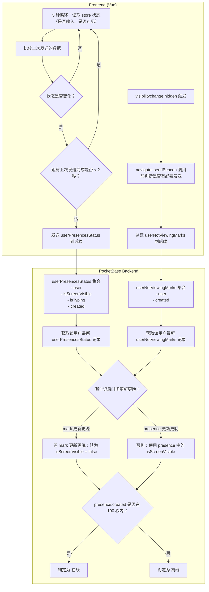

当然可以，我给你画一张 **完全基于你当前 PocketBase Presence 系统设计** 的 **Mermaid 架构图**。  
这张图可以直接放进：

- VSCode 的 Markdown
- Obsidian
- GitHub README
- JSDoc（作为代码块）

并且会被自动渲染成图。

下面就是你要的 **Mermaid 图**。

---

# 🟦 Presence 系统完整 Mermaid 架构图（可直接复制）

---

# 🟦 这张图表达了什么？

它完整表达了你系统的三大核心机制：

## **1. 前端状态循环（5 秒）**

- 检查输入状态
- 检查可见性
- 比较上次发送的数据
- 节流（2 秒内不重复发送）
- 状态变化立即发送

## **2. sendBeacon（visibilitychange hidden）**

- 页面隐藏时立即发送
- 不带鉴权
- 创建 userNotViewingMarks
- 避免重复发送

## **3. PocketBase 后端**

- `userPresencesStatus`：主状态快照
- `userNotViewingMarks`：补充“未查看”标记
- 合并逻辑：
    - 哪个记录更新更晚
    - 判断屏幕是否显示
    - 判断是否在线（100 秒规则）

---

# 🟦 如果你愿意，我还能继续为你生成：

### ✔ PlantUML 版本（可导出 ASCII 图）

### ✔ ASCIIFlow 版本（纯字符 UI 布局图）

### ✔ Presence 系统的 UI 布局图（Mermaid / PlantUML）

### ✔ Presence 系统的前端状态机图（Mermaid stateDiagram）

### ✔ Presence 系统的 ER 图（Mermaid erDiagram）

你想继续哪一种？